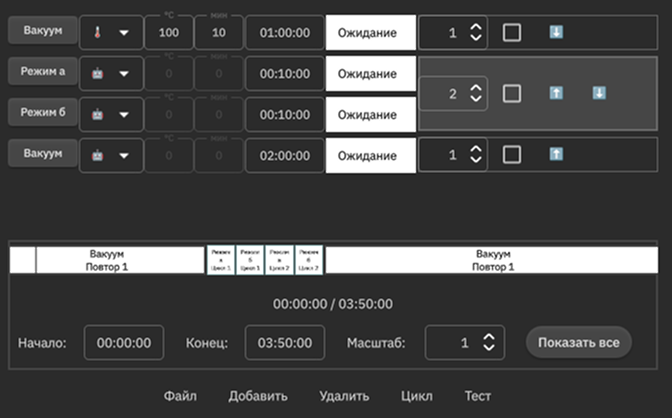
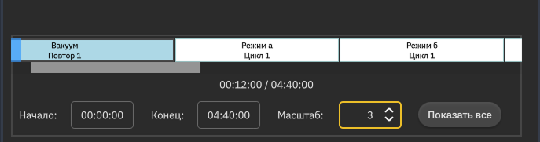

# ProtoTable Module

**ProtoTable** is a versatile QML module designed for action and task automation. It provides a feature-rich table interface for managing, importing, and exporting tasks from JSON files. Key features include the ability to select, group, and reorder tasks, along with an innovative **Time Progress Bar** for visualizing task execution.

## Screenshots

<p align="center">
  
</p>

### Time Progress Bar

The Time Progress Bar provides a visual representation of the entire task sequence. It displays each task as a colored block, with the width of the block representing the duration of the task. The progress bar is scalable, allowing you to zoom in and out to view the timeline at different levels of detail.

<p align="center">
  
</p>

## Dependencies

- **Qt 6.9**

## Integration

### 1. Build System (CMake)

To integrate the `ProtoTable` module into your project, you need to add it as a subdirectory in your `CMakeLists.txt` file and link against the `prototablemodel` library.

```cmake
# Add the ProtoTable module as a subdirectory
add_subdirectory(path/to/prototype_table)

# Include the module's headers
target_include_directories(${EXECUTABLE_NAME} PUBLIC
    ${CMAKE_CURRENT_SOURCE_DIR}/path/to/prototype_table
)

# Link your executable against the prototablemodel library
target_link_libraries(your_executable PRIVATE prototablemodel)
```

### 2. C++ Integration

Before creating the `QQmlApplicationEngine`, you need to register the necessary types and the `RegimeManager` singleton.

```cpp
#include "regimemanager.h"
#include "regime.h"

// ...

// Create an instance of RegimeManager
RegimeManager m_regimeManager;

// Register custom types
qRegisterMetaType<Condition>();
qmlRegisterUncreatableMetaObject(RegimeEnums::staticMetaObject, "com.grams.prototable", 1, 0, "RegimeState", "Error: only enums");

// Register RegimeManager as a QML Singleton
qmlRegisterSingletonInstance("com.grams.prototable", 1, 0, "RegimeManager", &m_regimeManager);

QQmlApplicationEngine engine;

// ...
```

### 3. QML Integration

Once the `RegimeManager` is registered as a singleton, you can access it from any QML file. The `RegimeManager` provides access to the data model (`RegimeManager.model`) and a set of `Q_INVOKABLE` methods for controlling the module.

Here is an example of how to use the `ProtoTable` module in your QML code:

```qml
import QtQuick 2.15
import QtQuick.Controls 2.15
import com.grams.prototable 1.0

ApplicationWindow {
    width: 800
    height: 600
    visible: true

    // The main view of the ProtoTable module
    RunTable {
        anchors.fill: parent
    }

    // Example of how to call a method on the RegimeManager
    Button {
        text: "Load Default Regimes"
        onClicked: {
            RegimeManager.loadDefaultRegimes()
        }
    }
}
```

## 4. RegimeManager API

The `RegimeManager` class provides a comprehensive API for managing and controlling regimes. The following methods are available as `Q_INVOKABLE` from QML:

### Data Management

- `loadDefaultRegimes()`: Loads the default set of regimes from the `regime_a.json` file.
- `importRegimes()`: Opens a file dialog to import regimes from a JSON file.
- `exportRegimes()`: Opens a file dialog to export the current set of regimes to a JSON file.
- `saveRegimes()`: Saves the current set of regimes to the file they were imported from.
- `saveRegimesAs()`: Opens a file dialog to save the current set of regimes to a new JSON file.

### Table Manipulation

- `addRow()`: Adds a new empty regime to the table.
- `deleteRows(rows)`: Deletes the specified rows from the table.
- `groupRows(rows)`: Groups the specified rows into a cycle.
- `ungroupRows(rows)`: Ungroups the specified rows.
- `moveRows(rows, direction)`: Moves the specified rows up or down.

### State and Progress Control

- `setRegimeState(regimeId, state, timePassed)`: Sets the state of a regime.
- `startRegimeExecution(regimeId)`: Starts the execution of a regime.
- `updateConditionProgress(regimeId, timeElapsed, currentRepeat)`: Updates the progress of the condition phase of a regime.
- `confirmConditionCompletion(regimeId, currentRepeat)`: Confirms the completion of the condition phase of a regime.
- `updateRegimeProgress(regimeId, timeElapsed, currentRepeat)`: Updates the progress of the execution phase of a regime.
- `completeCurrentRepeat(regimeId, currentRepeat)`: Marks the current repeat of a regime as complete.
- `completeRegimeExecution(regimeId)`: Marks the entire regime as complete.
- `skipCurrentRepeat(regimeId, currentRepeat)`: Skips the current repeat of a regime.
- `markRepeatAsError(regimeId, currentRepeat)`: Marks the current repeat of a regime as an error.
- `resetRegimeExecution(regimeId)`: Resets the execution state of a regime.

### Data Retrieval

- `getRegimeExecutionInfo(regimeId)`: Returns a `QVariantMap` with detailed information about the execution state of a regime.
- `getRepeatsDone(regimeId)`: Returns the number of completed repeats for a regime.
- `getRepeatsSkipped(regimeId)`: Returns the number of skipped repeats for a regime.
- `getRepeatsError(regimeId)`: Returns the number of repeats with errors for a regime.
- `getRepeatsLeft(regimeId)`: Returns the number of remaining repeats for a regime.
- `getTimeLeftForRegime(regimeId)`: Returns the remaining time for the current repeat of a regime.
- `getConditionTimePassedForRegime(regimeId)`: Returns the time passed for the condition phase of a regime.
- `getConditionTimeLeftForRegime(regimeId)`: Returns the remaining time for the condition phase of a regime.
- `getTotalTimeForRegime(regimeId)`: Returns the total time for a regime.
- `getElapsedTimeForRegime(regimeId)`: Returns the elapsed time for the current repeat of a regime.
- `getTimeLeftForCycle(cycleId)`: Returns the remaining time for a cycle.
- `getTotalTimeForCycle(cycleId)`: Returns the total time for a cycle.
- `getElapsedTimeForCycle(cycleId)`: Returns the elapsed time for a cycle.
- `getTotalEstimatedTime()`: Returns the total estimated time for all regimes.
- `getTotalElapsedTime()`: Returns the total elapsed time for all regimes.
- `getEstimatedTimeLeft()`: Returns the estimated time remaining for all regimes.

### Testing

- `testUpdatingRegimes()`: A test function to demonstrate how to update regime progress.

## 5. Testing

The module includes a `tests` folder with unit tests. To run the tests, you need to enable testing in your `CMakeLists.txt` file:

```cmake
enable_testing()
```

If you do not want to run the tests, you can simply delete the `tests` folder.
